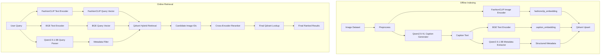

# Fashion Retrieval System: Complete Project Workflow

This document describes how the current project works end-to-end, based on the present codebase.

## 1. What This System Does

The system retrieves fashion images using a multimodal pipeline:
- visual similarity (FashionCLIP image/text space)
- caption semantic similarity (BGE embedding space)
- structured metadata filtering (garments, accessories, outfit, scene, person)
- cross-encoder reranking

It has two major phases:
- offline indexing: build and store searchable representations for images
- online retrieval: parse user query and return ranked matching images

## 2. Current Model Roles

Configured in `configs/models.yaml`.

- VLM caption model: `Qwen/Qwen2.5-VL-3B-Instruct`
- Structured parser model (used both online and offline metadata extraction): `Qwen/Qwen2.5-1.5B-Instruct`
- Image and text embedding model for fashion space: `patrickjohncyh/fashion-clip`
- Caption embedding model: `BAAI/bge-base-en-v1.5`
- Reranker model: `cross-encoder/ms-marco-MiniLM-L-6-v2`

## 3. Core Data Schema

Defined in `src/schemas.py`.

Main objects:
- `FashionMetadata`
  - `garments[]` (`Garment`): category, subcategory, colors, patterns, material, fit
  - `accessories[]` (`Accessory`): category, subcategory, colors
  - `outfit` (`Outfit`): styles, occasions
  - `scene` (`SceneInfo`): location, environment, activity
  - `person` (`PersonInfo`): gender, num_people
- `IndexedImage`
  - image_id, image_path, caption, metadata
  - `fashionclip_embedding` (dim 512)
  - `caption_embedding` (dim 768)
- `RetrievalResult`
  - image_id, image_path, caption, metadata, score

## 4. Offline Indexing Workflow

Primary entry point: `scripts/build_index.py`.

### Step-by-step

1. Load app/model configuration from:
- `configs/config.yaml`
- `configs/models.yaml`

2. Configure Hugging Face cache path in script startup:
- `HF_HOME` defaults to `D:\hf_cache`
- `HUGGINGFACE_HUB_CACHE` defaults to `D:\hf_cache\hub`

3. Initialize components:
- caption generator: `src/vlm/caption_generator.py` (uses VLM backend)
- metadata extractor: `src/vlm/metadata_extractor.py` (uses Qwen 1.5B text model)
- FashionCLIP embedder: `src/embeddings/fashionclip_embedder.py`
- BGE text embedder: `src/embeddings/text_embedder.py`
- Qdrant client wrapper: `src/qdrant_store.py`
- index orchestrator: `src/indexing/staged_indexer.py` (loads/releases one model family per stage; resumable via JSONL checkpoints)

4. For each image:
- load image (`src/indexing/_image_loader.py`)
- generate caption with VLM
- generate structured metadata from caption using Qwen 1.5B
- batch encode image with FashionCLIP
- batch encode caption with BGE

5. Upsert to Qdrant with:
- named vectors:
  - `fashionclip_embedding`
  - `caption_embedding`
- payload fields:
  - `image_id`, `image_path`, `caption`
  - `garments`, `accessories`, `outfit`, `scene`, `person`

6. Continue with per-image and per-batch error handling so failures do not stop full indexing.

## 5. Qdrant Storage and Filtering

Implemented in `src/qdrant_store.py`.

### Collection design

- named vectors configured from `config.yaml`
- distances configured per vector spec

### Payload strategy

Current payload is flattened to architecture fields:
- `garments`
- `accessories`
- `outfit`
- `scene`
- `person`

There is backward-compatible payload parsing support for legacy nested `metadata` payloads when reading old points.

### Structured metadata filters

`build_metadata_filter(...)` creates Qdrant filter conditions from non-null query metadata:
- nested matching over `garments` and `accessories`
- outfit filters over `outfit.styles`, `outfit.occasions`
- scene filters over `scene.location`, `scene.environment`, `scene.activity`
- person filters over `person.gender`, `person.num_people`

## 6. Online Retrieval Workflow

Primary entry point: `scripts/search_cli.py`.

### Step-by-step

1. Load app/model configs and logging.
2. Configure Hugging Face cache path in script startup:
- `HF_HOME` defaults to `D:\hf_cache`
- `HUGGINGFACE_HUB_CACHE` defaults to `D:\hf_cache\hub`

3. Verify Qdrant collection exists.
4. Initialize online components:
- `QueryParser` (`src/retrieval/query_parser.py`) using Qwen 1.5B
- `Retriever` (`src/retrieval/retriever.py`) for hybrid vector retrieval
- `Reranker` (`src/retrieval/reranker.py`) for cross-encoder reranking
- attach Qdrant store to reranker for final hydration lookup

5. For a user query:
- parse query into `FashionMetadata` with Qwen 1.5B
- embed query text in two spaces:
  - FashionCLIP text embedding
  - BGE text embedding
- build optional metadata filter from parsed structure
- run two Qdrant vector searches with optional filter
- fallback to unfiltered search if filtered hits are too sparse
- fuse ranked lists via weighted Reciprocal Rank Fusion (RRF)
- rerank top candidates with cross-encoder
- perform final Qdrant lookup by ranked `image_id` list
- return final results with reranker scores

## 7. Reranking and Final Hydration

Implemented in `src/retrieval/reranker.py` and `src/qdrant_store.py`.

Behavior:
- reranker scores candidate `(query, caption)` pairs
- sorts by score descending
- calls `lookup_by_image_ids(...)` on Qdrant store
- preserves score order while replacing candidates with fresh full records

This matches architecture flow:
- Candidate IDs -> Cross-Encoder -> Final Qdrant Lookup -> Ranked Results

## 8. Runtime Device Behavior

Current code resolves `"auto"` explicitly per model (`src/vlm/vlm_backend.py`,
`metadata_extractor.py`, `query_parser.py`, `fashionclip_embedder.py`):
- CUDA is used when available.
- On CUDA, the two Qwen models (VLM caption + 1.5B parser/extractor) load
  **4-bit quantized** via `bitsandbytes`, so they fit on small-VRAM GPUs
  (tested target: 4GB) without needing to spill anywhere.
- CPU fallback loads in float32 with no `device_map`.

Important practical detail:
- `device_map="auto"` (accelerate's automatic CPU/disk offloading) is
  deliberately **never** used. On small-VRAM GPUs it silently pages weights
  to disk instead of erroring, which is not "slow" but effectively hangs
  (this caused a real multi-hour stall during initial indexing runs). If a
  model still doesn't fit after quantization, it will now raise a clear
  CUDA OOM instead.

## 9. Utility and Validation Scripts

- `scripts/download_models.py`
  - downloads configured models to local cache
  - supports targeted download via `--only`
- `scripts/test_models.py`
  - smoke tests model loading/inference for core components
- `scripts/smoke_test.py`
  - import and parser-level checks without full heavy inference
- `scripts/check_versions.py`
  - reports installed package version compliance

## 10. End-to-End Flow Summary

### Offline

Image dataset -> preprocess -> VLM caption -> Qwen 1.5B metadata -> FashionCLIP/BGE embeddings -> Qdrant upsert

### Online

User query -> Qwen 1.5B structured parse + dual embeddings -> Qdrant hybrid search + payload filtering -> RRF -> cross-encoder rerank -> Qdrant lookup -> final ranked results

## 11. Mermaid Architecture Snapshot

